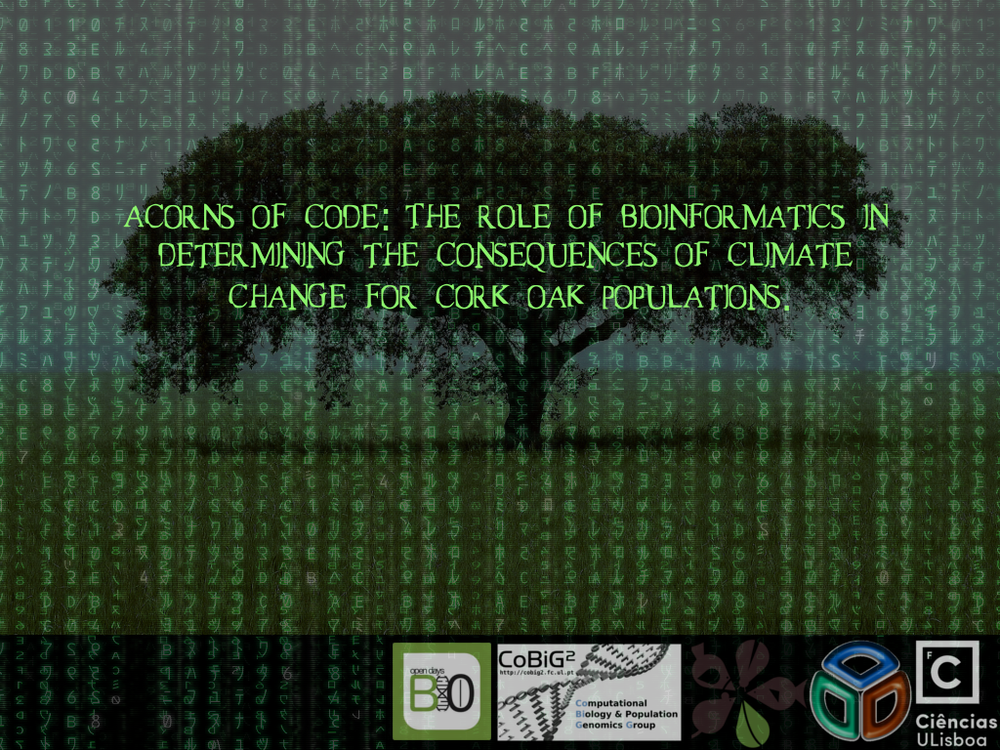
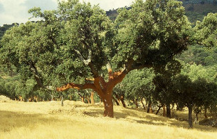

#Acorns of code: The role of bioinformatics in determining the consequences of climate change for cork oak populations.

##The role of Bioinformatics on assessing potential consequences of global climatic changes for a Mediterranean oak.

###Francisco Pina-Martins ([@FPinaMartins](https://twitter.com/FPinaMartins))
####Octávio S. Paulo
#####[https://stuntspt.github.io/BODs2017/](https://stuntspt.github.io/BODs2017/)

.fx: titleslide transparentheading imageslide

---

#The cork oak

* "Analyses of the genomic variation to study cork oak evolution and adaptation: from past to future climatic changes."

---

#The cork oak

* "Analyses of the genomic variation to study cork oak evolution and adaptation: from past to future climatic changes."

* "Programa Doutoral em Biologia e Ecologia das Alterações Globais"
* Evolutionary biology of *Quercus suber*

---
