#Acorns of code: The role of bioinformatics in determining the consequences of climate change for cork oak populations.

##What if bioinformatics could help us understand how cork oak tackles climate change?

###Francisco Pina-Martins ([@FPinaMartins](https://twitter.com/FPinaMartins))
####Octávio S. Paulo
#####[https://stuntspt.github.io/BODs2017/](https://stuntspt.github.io/BODs2017/)

.fx: titleslide transparentheading coverslide

---

#The cork oak

* "Analyses of the genomic variation to study cork oak evolution and adaptation: from past to future climatic changes."

.fx: alt_background

---

#The cork oak

* "Analyses of the genomic variation to study cork oak evolution and adaptation: from past to future climatic changes."

* "Programa Doutoral em Biologia e Ecologia das Alterações Globais"

.fx: alt_background

---

#The cork oak

* "Analyses of the genomic variation to study cork oak evolution and adaptation: from past to future climatic changes."

* "Programa Doutoral em Biologia e Ecologia das Alterações Globais"
* Evolutionary biology of *Quercus suber*

.fx: alt_background

---

#The cork oak

* Very broad distribution

.fx: alt_background

---

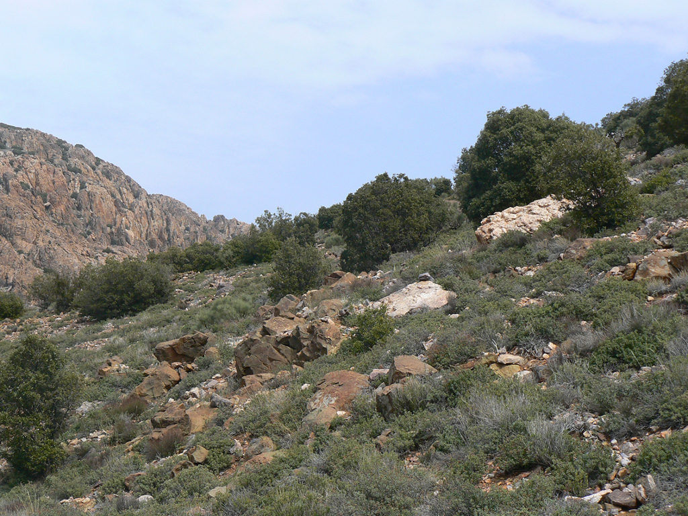

.fx: imageslide

---

.fx: imageslide

---

#The cork oak

* Very broad distribution

.fx: alt_background

---

#The cork oak

* Very broad distribution

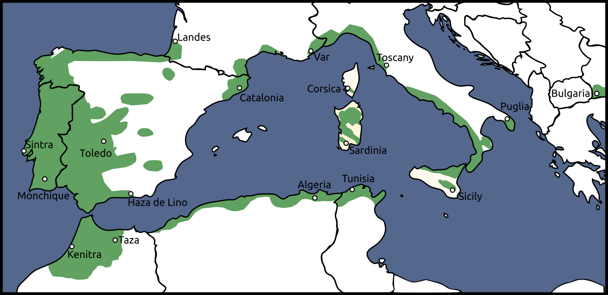

.fx: alt_background

---

#The cork oak

* Plenty of previous studies

.fx: alt_background

---

#The cork oak

* Plenty of previous studies
    * Ecological

.fx: alt_background

---

#The cork oak

* Plenty of previous studies
    * Ecological

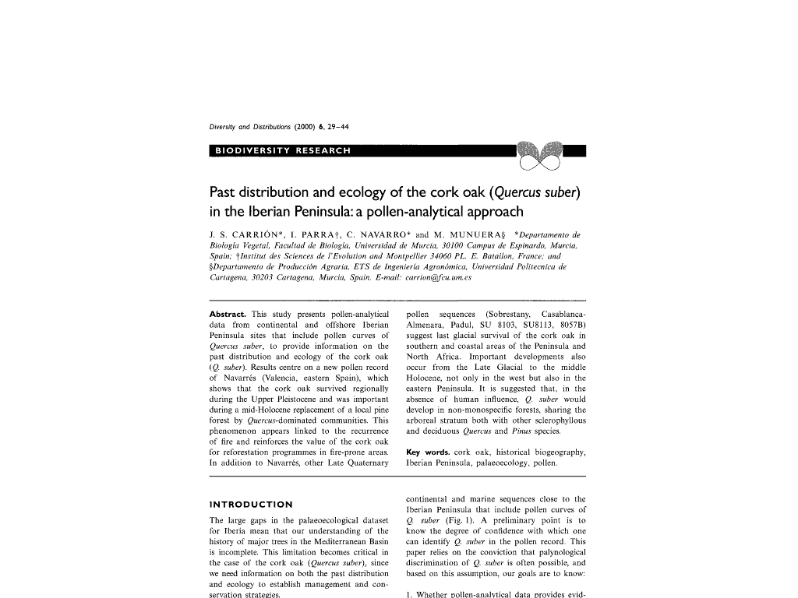

.fx: compimageslide alt_background

---

#The cork oak

* Plenty of previous studies
    * Ecological
    * Physiological

.fx: alt_background

---

#The cork oak

* Plenty of previous studies
    * Ecological
    * Physiological

.fx: compimageslide alt_background

---

#The cork oak

* Plenty of previous studies
    * Ecological
    * Physiological
    * Dispersal

.fx: alt_background

---

#The cork oak

* Plenty of previous studies
    * Ecological
    * Physiological
    * Dispersal

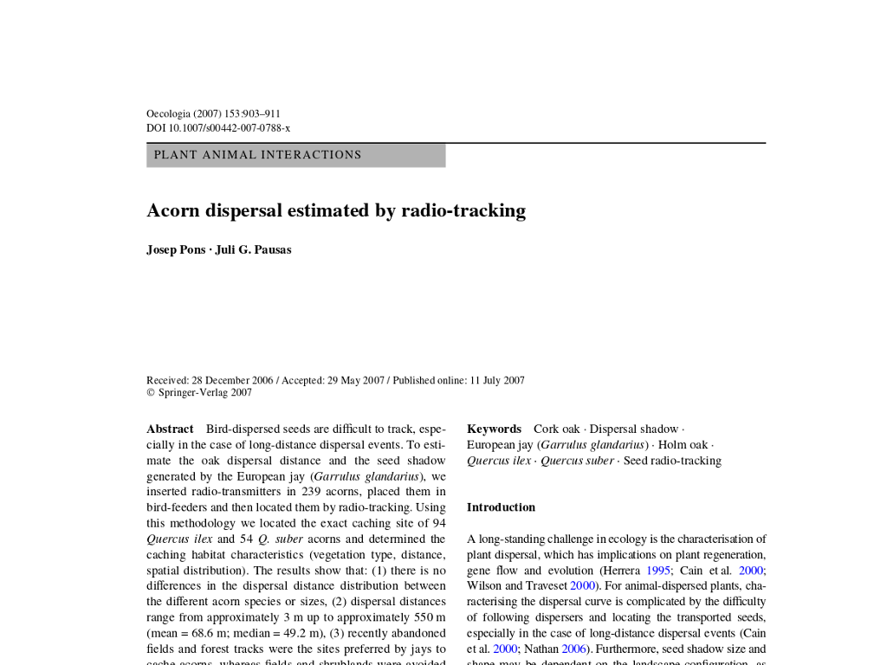

.fx: compimageslide alt_background

---

#The cork oak

* Plenty of previous studies
    * Ecological
    * Physiological
    * Dispersal
    * Genetic

.fx: alt_background alt_background

---

#The cork oak

* Plenty of previous studies
    * Ecological
    * Physiological
    * Dispersal
    * Genetic

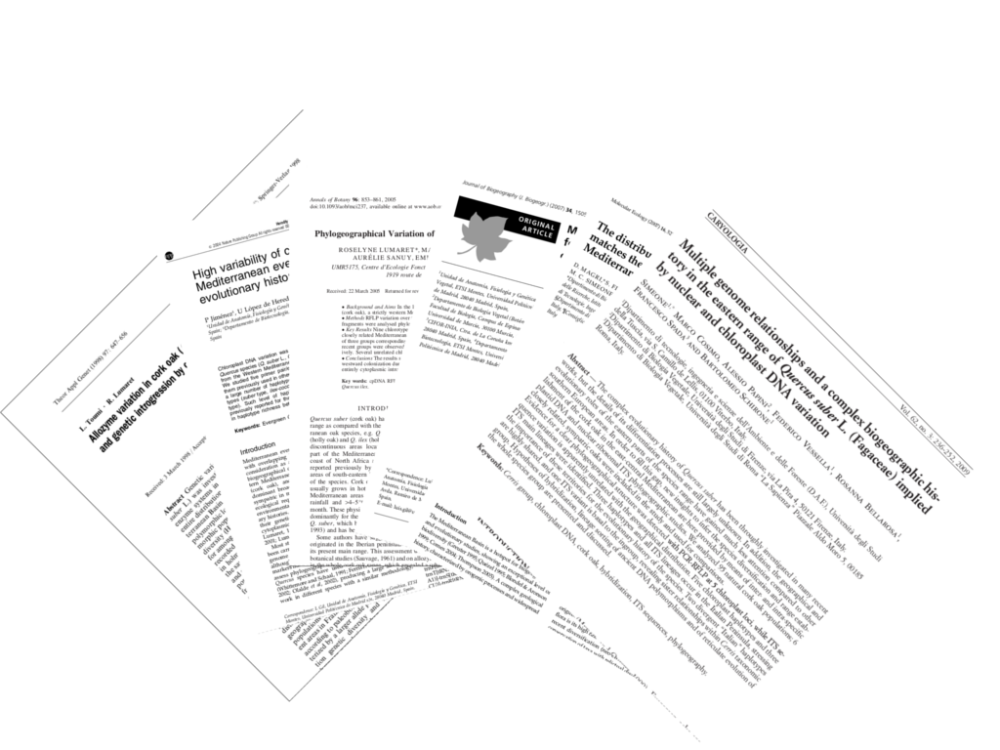

.fx: compimageslide alt_background

---

#The cork oak

* Hardly any genomic resources

.fx: alt_background

---

#The cork oak

* Hardly any genomic resources
    * No reference genome

.fx: alt_background

---

#The cork oak

* Hardly any genomic resources
    * No reference genome
    * Few GenBank resources (591 "cds" records)

.fx: alt_background

---

#The cork oak

* Hardly any genomic resources
    * No reference genome
    * Few GenBank resources (591 "cds" records)
        * 460 of which are from a paper from our group

.fx: alt_background

---

#The cork oak

* Hardly any genomic resources
    * No reference genome
    * Few GenBank resources (591 "cds" records)
        * 460 of which are from a paper from our group
    * Very few annotations

.fx: alt_background

---

#The strategy

* 454

.fx: alt_background muchsmaller

---

#The strategy

* 454
    * Exploration

.fx: alt_background muchsmaller

---

#The strategy

* 454
    * Exploration
* Sequenom

.fx: alt_background muchsmaller

---

#The strategy

* 454
    * Exploration
* Sequenom
    * Pop. genetics/Evo. history

.fx: alt_background muchsmaller

---

#The strategy

* 454
    * Exploration
* Sequenom
    * Pop. genetics/Evo. history
* GBS

.fx: alt_background muchsmaller

---

#The strategy

* 454
    * Exploration
* Sequenom
    * Pop. genetics/Evo. history
* GBS
    * **G**enome **W**ide **A**ssociation **S**tudy (**GWAS**)

.fx: alt_background muchsmaller

---

#The strategy

* 454
    * Exploration
* Sequenom
    * Pop. genetics/Evo. history
* GBS
    * **G**enome **W**ide **A**ssociation **S**tudy (**GWAS**)

.fx: alt_background muchsmaller

---

#The strategy

* 454
    * Exploration
* Sequenom
    * Pop. genetics/Evo. history
* GBS
    * **G**enome **W**ide **A**ssociation **S**tudy (**GWAS**)

**[Take the red pill]**

.fx: muchsmaller

---

#454 data

* No strain information

---

#454 data

* No strain information
* No reference genome

---

#454 data

* No strain information
* No reference genome
* How do we call SNPs?

---

#454 data

* No strain information
* No reference genome
* How do we call SNPs?

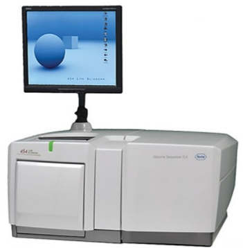

---

#454 data

* Manual methods
* *Custom scripts*
* Develop our own method
* Meet *[4Pipe4](https://bmcbioinformatics.biomedcentral.com/articles/10.1186/s12859-016-0892-1)*

.fx: github 

---

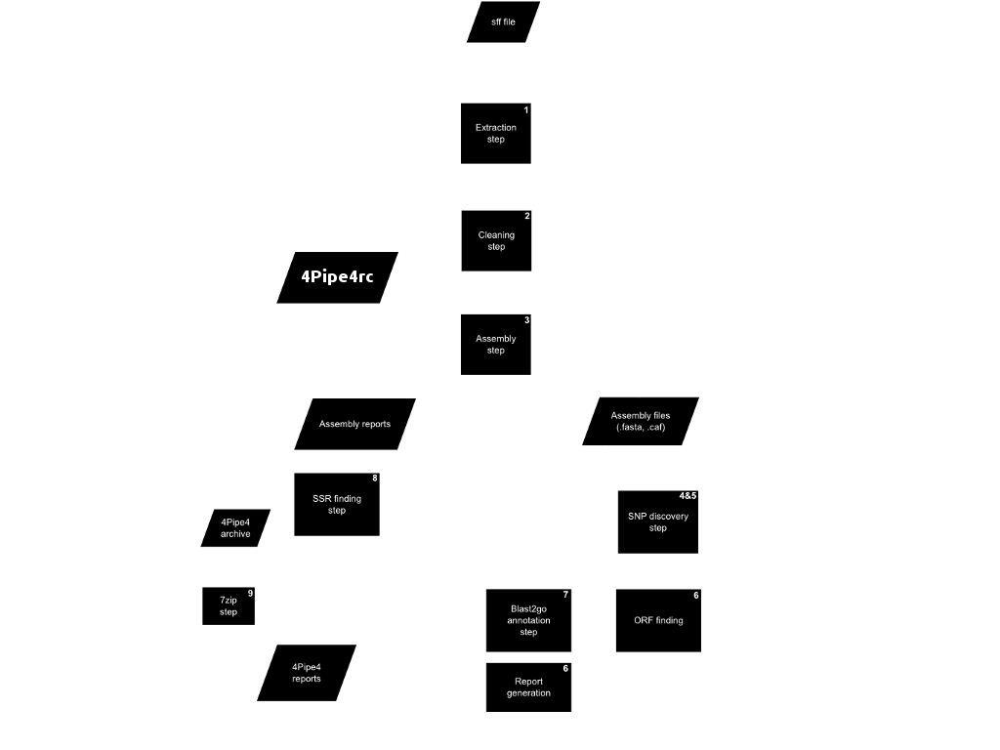

.fx: imageslide

---

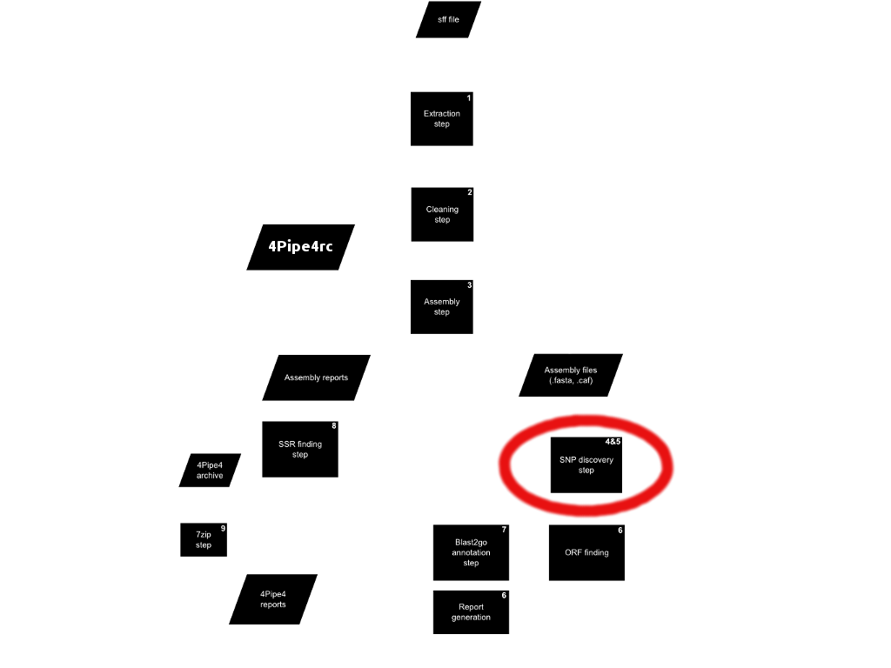

.fx: imageslide

---

#*4Pipe4*

* Started in 2010
* Written in *python 3*
    * Functional programming
    * Split in modules
    * Small use of classes
* Outperforms every other tested method on **P**ositive **P**redictive **V**alue (**PPV**)
* Published in 2016

.fx: github 

---

#454 data

* Resulted in 402 called SNPs
    * All SNPs were called inside ORFs
    * All had a BLAST match to *something*

* Validation
* Referencing

---

#Sequenom data

* Based on the previous 454 dataset
* 17 sampling sites
* 36 SNPs expanded to 275 individuals
* Little missing data

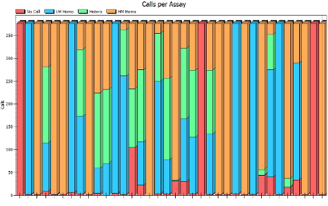

---

#Sequenom data analyses

* Fixed dataset
* Performed plenty of test runs
* Great as 'hands on' approach to SNP data analyses

* **Mostly** manual

---

#Structure_threader

* Automates & paralelizes STRUCTURE & fastStructure analyses

* Saved a reasonale ammount of analyses time
* Less human intervention == less random error

.fx: github

---

#Structure_threader

* Written in *python 3*
    * Uses `multiprocessing` module
    * Concurrency, race conditions, multi-threaded I/O
    * Unit tests
    * Uses setup.py

Easy to install from pypi:

    !python
    pip3 install structure_threader --user

.fx: github

---

#GBS data

* Somewhat large dataset (23M reads)
* 95 individuals from 17 sampling sites
* *RAW* data

---

#GBS data analyses

* **R**educed **R**epresentation **L**ibraries (**RRLs**) analysis techniques are still under active development

* Changes in the SNP caller influence the entire process
* Implies **a lot** of repetition

---

#GBS data analyses

* Automation

* Has the nice side effect of making the entire process reproducible
* Can be relatively flexible

---

#RONA

* **R**isk **o**f **N**on-**A**daptedness (**RONA**)

---

#RONA

* **R**isk **o**f **N**on-**A**daptedness (**RONA**)
* Rellstab *et* al. 2016

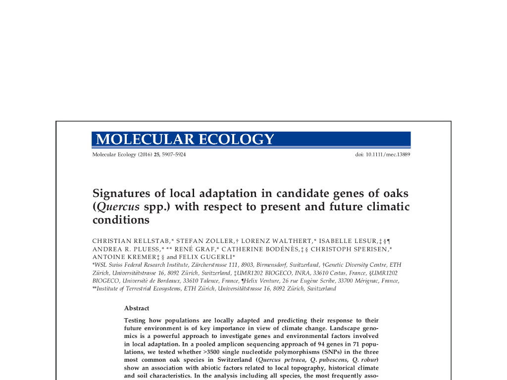

.fx: compimageslide

---

#RONA

* **R**isk **o**f **N**on-**A**daptedness (**RONA**)
* Rellstab *et* al. 2016
* Uses genotype-environment analyses to predict the RONA
* However, there was no implementation
    * Method is simply "described"
    * Refers several time to "in house scripts"
* Despite this "shortcoming", it's still awesome

---

#RONA

* Python to the rescue again

* Implemented as [pyRona](https://github.com/StuntsPT/pyRona)
* Slightly different from the original
* Still WIP

.fx: github

---

#Biological results

* The short version

---

#454 & Sequenom

* Found some interesting associations between well known genes and environmental variables
    * eg. "Heat shock protein" && Max. Temperature
    * May provide interesting follow ups
* First evidence that nuclear SNPs and cpDNA tell a different evolutionary history

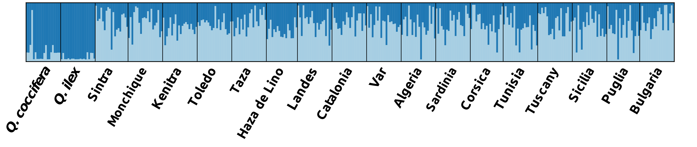

.fx: alt_background

---
