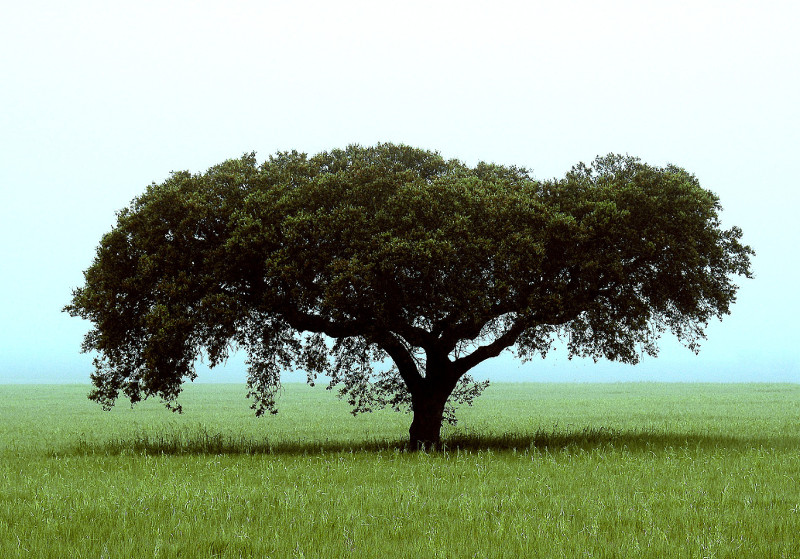

#Acorns of code: The role of bioinformatics in determining the consequences of climate change for cork oak populations.

##The role of Bioinformatics on assessing potential consequences of global climatic changes for a Mediterranean oak.

###Francisco Pina-Martins ([@FPinaMartins](https://twitter.com/FPinaMartins))
####Octávio S. Paulo
#####[https://stuntspt.github.io/BODs2017/](https://stuntspt.github.io/BODs2017/)

.fx: titleslide transparentheading coverslide

---

#The cork oak

* "Analyses of the genomic variation to study cork oak evolution and adaptation: from past to future climatic changes."

---

#The cork oak

* "Analyses of the genomic variation to study cork oak evolution and adaptation: from past to future climatic changes."

* "Programa Doutoral em Biologia e Ecologia das Alterações Globais"

---

#The cork oak

* "Analyses of the genomic variation to study cork oak evolution and adaptation: from past to future climatic changes."

* "Programa Doutoral em Biologia e Ecologia das Alterações Globais"
* Evolutionary biology of *Quercus suber*

---

#The cork oak

* Very broad distribution

---

.fx: imageslide

---

.fx: imageslide

---

#The cork oak

* Very broad distribution

---

#The cork oak

* Very broad distribution

---

#The cork oak

* Plenty of previous studies

---

#The cork oak

* Plenty of previous studies
    * Ecological

---

#The cork oak

* Plenty of previous studies
    * Ecological

.fx: compimageslide

---

#The cork oak

* Plenty of previous studies
    * Ecological
    * Physiological

---

#The cork oak

* Plenty of previous studies
    * Ecological
    * Physiological

.fx: compimageslide

---

#The cork oak

* Plenty of previous studies
    * Ecological
    * Physiological
    * Dispersal

---

#The cork oak

* Plenty of previous studies
    * Ecological
    * Physiological
    * Dispersal

.fx: compimageslide

---

#The cork oak

* Plenty of previous studies
    * Ecological
    * Physiological
    * Dispersal
    * Genetic

---

#The cork oak

* Plenty of previous studies
    * Ecological
    * Physiological
    * Dispersal
    * Genetic

.fx: compimageslide

---

#The cork oak

* Hardly any genomic resources

---

#The cork oak

* Hardly any genomic resources
    * No reference genome

---

#The cork oak

* Hardly any genomic resources
    * No reference genome
    * Few GenBank resources (591 "cds" records)

---

#The cork oak

* Hardly any genomic resources
    * No reference genome
    * Few GenBank resources (591 "cds" records)
        * 460 of which are from a paper from our group

---

#The cork oak

* Hardly any genomic resources
    * No reference genome
    * Few GenBank resources (591 "cds" records)
        * 460 of which are from a paper from our group
    * Very few annotations

---

#The cork oak

---

#The cork oak

---

